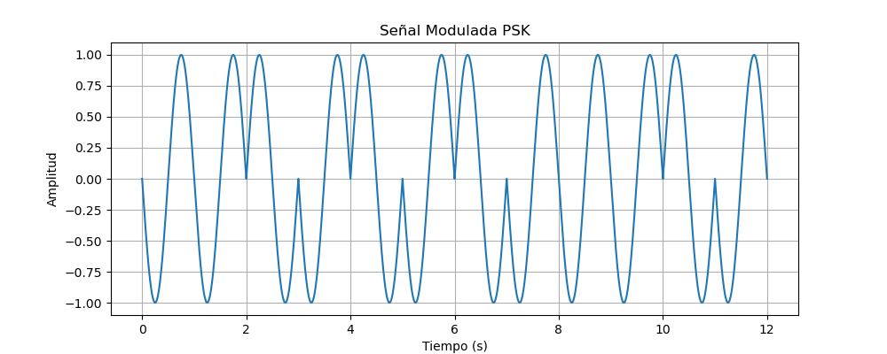

## IE0527_P_Simulacion:
Este repositorio almacena el código y recursos necesarios para simular la comunicación entre una habitación de una casa y una casita de árbol en el jardín; se establece un mensaje de texto de entrada que está previamente generado, codificamos el mensaje en la fuente utilizando el algoritmo de Huffman y para la codificación del canal se utilizará Hamming para agregar la capacidad de detección de errores; la señal se transmitirá por radiofrecuencia.

# Escenario hipotético: 
Simulación de un chat de texto, entre la habitación de una casa y una casita en el árbol.

## Carga del archivo:
El mensaje que enviaremos en la simulación se encuentra en:
```
PySIM/datasets/INPUT.txt
```
Y la simulación tomará en cuenta que este archivo de text fue previamente generado.

## Codificación de la fuente:
Para la codificación de la fuente implementamos el algoritmo de Huffman. El código para la codificacion de la fuente se encuentra en:
```
PySIM/src/CODIFICADOR.py
```

## Codificación del canal:
Implementamos el algoritmos de [Hamming](https://www.youtube.com/watch?v=WdmGSWrcMvM) para condificar el código generado en la etapa de codificacion de fuente; este algoritmo nos permite la corrección de errores en la recepción del mensaje, incorporando bits de paridad al código.
```
PySIM/src/HAMMING.py
```

## Modulación:
Para la modulación del codigo generado por el algoritmo de Hamming, utilizaremos BPSK, que nos permite representar los bits codificados por medio de 2 fases de onda portadora.
```
PySIM/src/PSK.py
```
### Ejemplo:
Al resibir el codigo de bits "110101011101", la codificación PSK genera la siguiente señal de salida:


