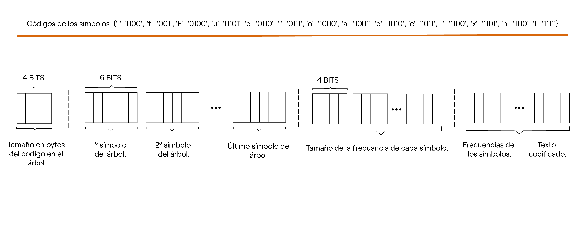
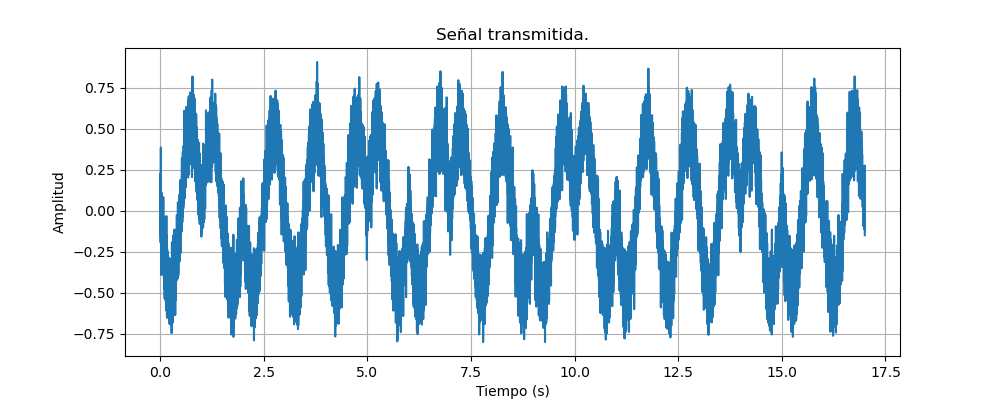
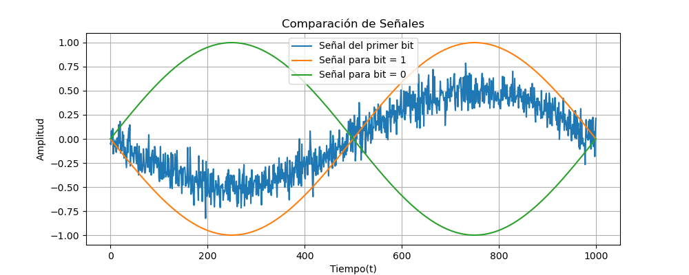
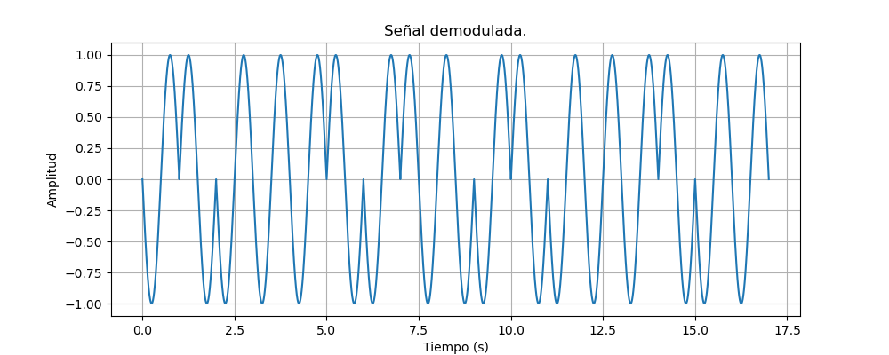

## IE0527_P_Simulacion:
Este repositorio almacena el código y recursos necesarios para simular la comunicación entre una habitación de una casa y una casita de árbol en el jardín; se establece un mensaje de texto de entrada que está previamente generado, codificamos el mensaje en la fuente utilizando el algoritmo de Huffman y para la codificación del canal se utilizará Hamming para agregar la capacidad de detección de errores; la señal se transmitirá por radiofrecuencia.

# Escenario hipotético: 
Simulación de un chat de texto, entre la habitación de una casa y una casita en el árbol.

## Carga del archivo:
El mensaje que enviaremos en la simulación se encuentra en:
```
PySIM/datasets/INPUT.txt
```
Y la simulación tomará en cuenta que este archivo de texto fue previamente generado.

## Codificación de la fuente:
Para la codificación de la fuente implementamos el algoritmo de [Huffman](https://www.youtube.com/watch?v=dM6us854Jk0). Una vez que hemos codificado el texto, procedemos a codificar el árbol, incorporando meta datos a la señal del texto codificado. La estructura de nuestra señal es la siguiente:



Primero añadimos 4 bits que indican el tamaño en bytes del código que define el árbol de Huffman; la señal codificada del árbol se forma representando los símbolos en grupos de 6 bits, que se decodifican con el <diccionario_simbolos{}>, estos grupos de 6 bits se acomodan da mayor a menor frecuencia en la codificación del árbol; seguidamente se agregan los tamaños de las frecuencias que se indican en un paquete de 4 bits para cada símbolo, finalmente se toman los bits del código de Huffman de cada símbolo, se concatenan y se agrega el código del texto codificado al final del código completo de la señal codificada en la fuente. 
> [!IMPORTANT]
> Estos metadatos no se aprecian en las señales de ejemplo, debido a que aumentan considerablemente la cantidad de bits y no permiten apreciar claramente las señales.

El código para la codificación de la fuente se encuentra en:
```
PySIM/src/CODIFICADOR.py
```
### Ejemplo:
Para ejemplificar los resultados de la simulación tomamos como texto el código de entrada **110101011101**. La codificación de Huffman para este texto es **110101011101**

## Codificación del canal:
Implementamos el algoritmo de [Hamming](https://www.youtube.com/watch?v=WdmGSWrcMvM) para codificar el código generado en la etapa de codificación de fuente; este algoritmo nos permite la corrección de errores en la recepción del mensaje, incorporando bits de paridad al código.

El código de la codificación Hamming se encuentra en:
```
PySIM/src/HAMMING.py
```
### Ejemplo:
Al ingresar el código generado por el algoritmo de Huffman, la codificación Hamming resultante es **10111010010111011**

## Modulación:
Para la modulación del código generado por el algoritmo de Hamming, utilizaremos BPSK, que nos permite representar los bits codificados por medio de 2 fases de onda portadora.
```
PySIM/src/PSK.py
```
### Ejemplo:
Al recibir el código de bits "110101011101", la codificación PSK genera la siguiente señal de salida:


## Transmisión:
Simulamos un medio con ruido y una atenuación de la señal del 50%, para simular componentes y medios ruidosos que podríamos esperar en la aplicación real de un proyecto de este estilo.
```
PySIM/src/TRANSMISION.py
```
### Ejemplo:
Para la señal transmitida utilizamos el resultado de la señal PSK que diseñamos en la etapa de modulación, el grafico de la señal transmitida es el siguiente:



## Demodulación:
Para demodular la señal transmitida utilizamos un comparador individual de señales; para conocer si el resultado de la transmisión con ruido representa un 0 o un 1. La comparación entre la señal del primer bit enviado y las máscaras de las señales para 0 y 1 es:



### Ejemplo:
Continuando con nuestro ejemplo, la señal demodulada del código de ejemplo es:



Que coincide con la señal modulada. Generando el código **10111010010111011**, que coincide por el código generado en la etapa de *codificación de canal*.

La demodulación se encuentra en:
```
PySIM/src/PSK.py
```

## Decodificación de canal:
Manteniendo la lógica de la simulación, implementamos la extracción de código codificado por el algoritmo de Hamming.

El código de la decodificación Hamming se encuentra en:
```
PySIM/src/HAMMING.py
```

### Ejemplo:
Al ejecutar la simulación el código decodificado es **110101011101**; que era el texto inicial de nuestro ejemplo.

## Decodificación de fuente:
Una vez que obtenemos el código decodificado de la señal transmitida, debos realizar la decodificación de Huffman, para conocer el texto original que fue enviado.